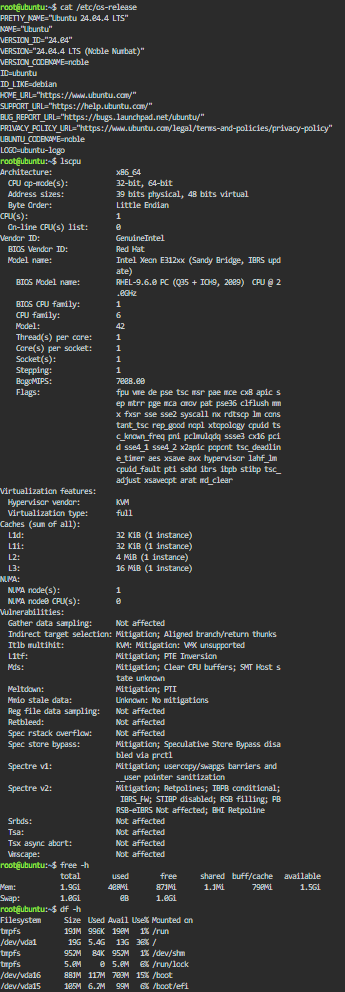

## Checkpoint 7 – Linux Server Investigation

For this checkpoint, I launched a Linux server using the KillerCoda Playground. I used Linux commands to identify the operating system, CPU information, memory, and available disk space.

### Linux System Information

| Information | Command Used | Result |
|---|---|---|
| Operating System | `cat /etc/os-release` | *(paste your actual output)* |
| CPU Information | `lscpu` | *(paste your actual output)* |
| Memory | `free -h` | *(paste your actual output)* |
| Disk Space | `df -h` | *(paste your actual output)* |

### Cloud Migration Options

If this Linux server were migrated to the cloud, it could be hosted using virtual machine services from the major cloud providers.

* **AWS:** Amazon EC2
* **Microsoft Azure:** Azure Virtual Machines
* **Google Cloud:** Compute Engine

These services provide virtual machines that can run Linux-based workloads in the cloud. The Linux server's CPU, memory, storage, and operating system requirements would need to be considered when selecting the appropriate cloud instance or virtual machine configuration.

### Screenshot Evidence

The screenshot shows the Linux commands used to identify the server's operating system, CPU, memory, and disk space.