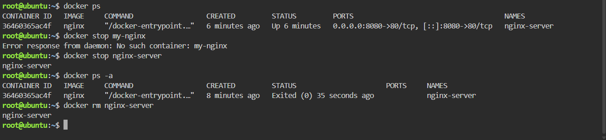

## Docker Container Lifecycle

### 1. List Running Containers

```bash
docker ps
```

This command displays the containers that are currently running.

### 2. Stop the Nginx Container

```bash
docker stop nginx-server
```

This command stops the running Nginx container named `nginx-server`.

### 3. Verify the Container Status

```bash
docker ps -a
```

This command displays all containers, including stopped containers, allowing me to verify that `nginx-server` has stopped.

### 4. Remove the Nginx Container

```bash
docker rm nginx-server
```

This command permanently removes the stopped `nginx-server` container.

### 5. Verify Removal

```bash
docker ps -a
```

This command confirms that the `nginx-server` container has been removed from the system.

### Screenshot

