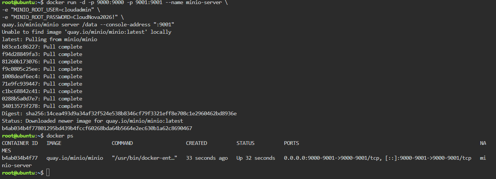
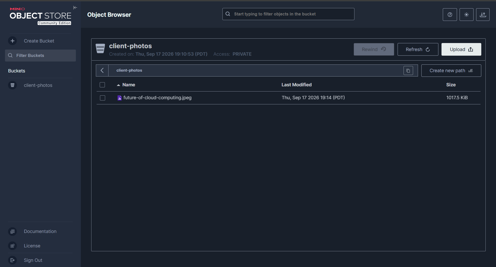

# MinIO Deployment Documentation

## Docker Command Used

```bash
docker run -d -p 9000:9000 -p 9001:9001 --name minio-server \
-e "MINIO_ROOT_USER=cloudadmin" \
-e "MINIO_ROOT_PASSWORD=CloudNova2026!" \
quay.io/minio/minio server /data --console-address ":9001"
```

**Note:** The original `minio/minio` image was no longer available on Docker Hub as of September 2026, since MinIO removed its Docker Hub namespace. The image was pulled instead from MinIO's official Quay.io registry using `quay.io/minio/minio`.

## Access Details

- **Web Console Port:** 9001
- **API Port:** 9000
- **Bucket Created:** `client-photos`

## Explanation of Environment Variables (`-e` flags)

The `-e` flag in Docker passes environment variables into the container at runtime, allowing configuration without modifying the image itself.

- `MINIO_ROOT_USER` — sets the administrator username used to log into the MinIO Web Console.
- `MINIO_ROOT_PASSWORD` — sets the administrator password paired with the root user.

These credentials control access to the entire MinIO instance, including bucket creation, file uploads, and server configuration.

## Screenshots


